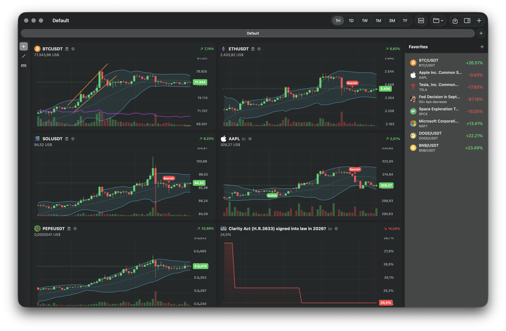

# DegenView



A native macOS market dashboard for watching crypto, stocks, prediction markets, and
CoinMarketCap market-wide indices in customizable charts and metric widgets. Built with
SwiftUI and an AppKit `Canvas`, with no external dependencies.

## Features

### Markets and live data

- **Crypto** — Search Binance, CoinGecko, and DEXScreener side by side. DEX pairs use
  GeckoTerminal for historical OHLCV data
- **Stocks** — Search and chart US equities through Alpaca's IEX feed (API credentials
  are stored securely in Keychain)
- **Prediction markets** — Search Polymarket events, chart probabilities as percentages,
  and toggle the outcome series shown for multi-outcome markets
- **CoinMarketCap indices** — Add historical or latest Altcoin Season and CMC Crypto Fear
  and Greed charts. The official Public API works without a key; an optional key stored in
  Keychain enables higher authenticated rate limits
- **Live updates** — Binance crypto and Alpaca stock charts receive WebSocket updates;
  other sources refresh automatically
- **Six timeframes** — 1H, 1D, 1W, 1M, 3M, and 1Y, with scroll-wheel zoom to change the
  visible candle count
- **Multi-source identity** — The same symbol can be added from different sources without
  being treated as a duplicate

### Charts and analysis

- **Market-wide index widgets** — Altcoin Season historical charts use API-supported 7D,
  30D, and 90D ranges with Bitcoin/neutral/altcoin regime context. Fear and Greed history
  supports 7D, 1M, 3M, 1Y, and paginated ALL views
- **Current index dashboards** — Altcoin Season Latest presents the current value,
  classification, yearly high/low, and altcoin market cap; Fear and Greed Latest uses a
  responsive semicircular sentiment gauge
- **Fixed index scale** — CoinMarketCap historical charts retain a meaningful 0–100 Y-axis
  with right-side labels, optional threshold zones and area fill, and classification-aware
  hover details

- **Native chart renderer** — Hand-drawn OHLC candlesticks, wicks, doji candles, line
  series, grid, time axis, adaptive price precision, current-price overlay, and price
  change readout; no SwiftUI Charts or third-party chart library
- **Indicators** — Per-chart volume, RSI (14), configurable EMA, Bollinger Bands, and
  confirmed bullish/bearish Supertrend flip markers
- **Local Pine v6-style indicators** — Write and run a useful Pine Script v6 subset
  directly on each market chart. The independent engine lexes, parses, validates, and
  evaluates scripts locally over OHLCV bars; source code is never sent to TradingView
- **Script plots and inputs** — Pine plots, horizontal levels, shapes, characters,
  backgrounds, and candle colors render through the native Canvas. Generated integer,
  float, boolean, and string controls reevaluate a script without recompiling it
- **Realtime series semantics** — Script state advances bar by bar with history references,
  persistent `var`, intrabar-persistent `varip`, realtime rollback, and `barstate.*`
- **Safe script editing** — Each chart persists its draft, last successfully applied
  source, and typed input values. Invalid drafts show line/column diagnostics while the
  last valid plot remains active
- **Per-chart appearance** — Custom bullish and bearish colors plus automatic or fixed
  Y-axis decimal precision
- **Independent price zoom** — Drag a chart's Y-axis to adjust its vertical scale
- **Crosshair** — Synchronized vertical inspection across all charts in a tab, with the
  hovered chart's price and time readout
- **Trend lines** — Draw, select, move, recolor, resize, and delete lines. Drawings are
  anchored to time and price and shared by every chart of the same instrument
- **Ruler** — Measure a move's price change, percentage, duration, and bar count with a
  green/red rectangle; measurements are intentionally temporary

### Portfolio tracking

- **Dedicated Portfolio tab** — Open Portfolio from any chart workspace into one native,
  persistent tab type with no chart-creation controls. The same tab can be reordered,
  detached, merged, and restored with the rest of the macOS tab session
- **Multiple portfolios** — Create, rename, duplicate, delete, reorder, and switch between
  independent portfolios, or use **All Portfolios** for aggregated holdings and allocation
- **Transaction ledger** — Holdings derive from Decimal-valued Buy, Sell, Transfer In,
  Transfer Out, reward, fee, and adjustment events instead of stored current quantities
- **Weighted-average accounting** — Purchase fees increase cost basis; sale fees reduce net
  proceeds; transfers remove proportional basis without realizing a market sale
- **Live analytics** — Current value, allocation, 24-hour movement, average cost, realized
  and unrealized P&L, best/worst performers, and unpriced-asset status update from the
  existing market-data sources
- **Portfolio history** — Transaction-aware value snapshots support 1D, 1W, 1M, 1Y, and
  ALL ranges with time and value axes, profit/loss coloring, and an interactive crosshair
- **Holdings and transactions** — Sort holdings, inspect asset-specific history, edit,
  duplicate, delete, or remap an asset to another source-qualified instrument
- **Privacy mode** — Globally hide balances, quantities, basis, values, P&L, chart values,
  and their accessibility descriptions
- **CSV workflows** — Preview and atomically import DegenView CSV files, and export
  transactions, current holdings, or portfolio history with timezone-bearing timestamps
- **CoinMarketCap import** — Parse CoinMarketCap transaction exports, auto-map tokens to
  portfolio-currency pairs (Binance first, then CoinGecko and DEXScreener), override or
  skip mappings, deduplicate reimports, and supply historical FX for foreign fees or skip
  individual affected rows

### Local price alerts

- **Four alert conditions** — Create absolute crosses-above/below alerts or percentage
  rise/fall alerts with a fixed reference price and materialized target
- **Once or repeating** — One-shot alerts move to Triggered after firing; repeating
  alerts re-arm only after the market moves strictly back across the target
- **Source-qualified assets** — Binance, CoinGecko, DEXScreener, and Alpaca alerts use the
  same stable provider-qualified identity as portfolio assets. Polymarket is excluded
- **Multi-currency targets** — Evaluate alerts in USD, EUR, GBP, JPY, or CHF using current
  daily Frankfurter reference rates cached locally for weekends and holidays
- **Alerts center** — Open the app-wide Alerts window from a chart bell or the Portfolio
  toolbar to search and filter Active, Triggered, Paused, All, and History records
- **Local delivery** — Trigger events can show an in-app banner and a macOS notification;
  delivery, sound, banners, and system notifications are independently configurable
- **Persistent local history** — Rules, crossing baselines, re-arm state, processed quote
  fingerprints, settings, and trigger history are stored in local JSON only

Alerts evaluate while DegenView is running, including when chart windows are hidden or
occluded. They cannot evaluate while the app is quit, the Mac is asleep, or fresh market
or FX data is unavailable. Turning delivery off suppresses banners and notifications but
does not stop evaluation or history recording. No account, CloudKit, remote alert API,
push service, login item, or background helper is used.

### Paper trading

Paper Trading is a local, persistent simulator and has no exchange-order endpoint or
credential-bearing execution adapter. The UI holds a `PaperTradingExecutionService`
directly; paper orders never route through Alpaca, Binance, or another live service.

- Market buys execute at ask and market sells at bid when both sides are available.
  The current chart feeds expose only last/bar prices, so those integrations use an
  audited `lastPriceFallback` fill source and never invent a spread.
- Quotes older than 30 seconds cannot execute market orders. Closed-market events keep
  working orders pending. The app currently has no exchange calendar, so chart sources
  only emit the open state they can establish; historical candles are never treated as
  proof that a market is open.
- Limit and stop conditions are evaluated from executable quote/trade events, not from
  pixels on the chart. There is no OHLC-touch fill path. Stop-limit orders activate at
  the stop and subsequently obey limit semantics.
- Positions use one net position per account and instrument with weighted-average cost.
  Reductions realize P&L against that average; reversals close the old side before
  opening the residual quantity on the new side. Fill records remain immutable.
- Long liquidation value uses bid and short liquidation value uses ask, falling back to
  last only when the feed has no bid/ask. P&L applies the instrument point value.
- Account-currency conversion is rejected when no reliable FX conversion is available.
  USD accounts may treat USDT/USDC quotes as USD for this simulator; this limitation is
  explicit rather than a general-purpose FX assumption.
- Fills are deterministic and complete because no connected source exposes reliable
  depth. The schema retains original, filled, and remaining quantities plus fill-level
  records so a future liquidity model can generate partial fills without migration.

### Historical bar replay

- **No-lookahead replay** — Choose a historical candle and progressively reveal the
  market from that point. Future candles are removed at the data boundary before chart
  rendering, indicators, volume, crosshair inspection, autoscaling, or drawing snapping
- **Native replay controls** — Select a bar, date/time, random bar, or first available
  bar; then step, play/pause, change speed or interval, restart, or return to latest
- **Granular Binance and Alpaca replay** — When lower-timeframe OHLCV is available,
  DegenView paginates up to 100,000 source bars and incrementally reconstructs the active
  displayed candle. Other providers fall back to deterministic complete-chart-bar steps
  without fabricating intrabar prices
- **Deterministic partial candles** — Open comes from the first observed source bar,
  high/low from observed extremes, close from the latest observed close, and volume from
  observed volume only. Source close times—not opening times—advance the replay clock
- **Shared replay clock** — Every chart in a tab is constrained by one authoritative
  historical timestamp, including layouts with different symbols
- **Replay-safe live data** — WebSockets and automatic refresh are suspended during
  replay and restored when returning to latest
- **Session restoration** — Interrupted replay state is saved with the tab and restored
  paused, including the start/current timestamps, interval, and speed
- **Keyboard controls** — **Shift–↓** toggles Play/Pause, **Shift–→** advances one step,
  and **Escape** cancels start-point selection

### Dashboard and persistence

- **Native macOS tabs and windows** — Every tab owns independent charts, timeframe,
  layout, zoom, refresh lifecycle, and drawing-tool state. Drag tabs to reorder or detach,
  drag windows onto a tab bar to merge, or use **File → Merge All Windows**
- **Restored sessions** — Tabs, ordering, names, window grouping, and window frames return
  on relaunch. The tab bar and its **+** remain visible even with one tab
- **Two layouts** — A vertical chart stack or responsive multi-column grid. Reorder cards
  within or across columns, or hold a dragged chart against the right edge to preview and
  create another column; empty columns disappear automatically
- **Saved views** — Save and reload named ticker sets with their timeframe, column and
  chart arrangement, layout, zoom, source, indicator, appearance, and CoinMarketCap
  chart/range settings. Saved views are shared across tabs
- **Unsaved-change tracking** — A contextual toolbar action appears when a loaded view has
  changed
- **Favorites sidebar** — Keep an app-wide, persistent, reorderable watchlist and open any
  favorite in the current tab
- **Coin and company artwork** — Multi-stage icon lookup with disk caching and a monogram
  fallback, so every card header remains aligned
- **Appearance** — System, Light, and Dark themes
- **Efficient background behavior** — Hidden tabs suspend polling and live streams;
  responses and rate-limited CoinGecko data are cached. CoinMarketCap requests use shared
  in-flight coalescing and freshness-aware caches rather than polling at dashboard speed

## Requirements

- macOS 14 or later
- Xcode 16 or later
- Swift 6
- A free Alpaca account and API keys only if you want stock data
- No CoinMarketCap API key is required; adding one in Settings is optional

## Build and run

```bash
open DegenView.xcodeproj
```

Then choose **Product → Run** (⌘R) in Xcode. You can also build from Terminal:

```bash
xcodebuild -project DegenView.xcodeproj -scheme DegenView build
```

DegenView uses only native SwiftUI, AppKit, URLSession, and WebSocket APIs—there are no
CocoaPods, Swift Package Manager, or Carthage dependencies.

## Usage

1. Click the toolbar **+** and choose Crypto, Stocks, Polymarket, CoinMarketCap, or
   Portfolio. Crypto search fans out across Binance, CoinGecko, and DEXScreener; stock
   search requires Alpaca keys in **Settings → Alpaca**. CoinMarketCap offers four
   market-wide index charts and works keylessly.
2. Pick a timeframe in the toolbar and scroll over a chart to zoom its history. Drag the
   price axis to zoom vertically.
3. Open a chart's gear menu to change its instrument, colors, decimal precision, and
   technical indicators. Use its **Scripts** tab to edit and apply a Pine v6-style
   indicator or change the generated inputs. The settings window can be resized.
4. Use the left tool strip for the synchronized crosshair, persistent trend lines, and
   temporary ruler measurements.
5. Switch between the vertical and grid layouts, then drag cards to reorder them within
   or across columns. Hold a card at the grid's right edge until the outlined preview
   column appears, then release it to create that column. The option appears only when
   the window is wide enough to keep every resulting column readable.
6. Save the dashboard as a named view. Use the folder menu to load or delete views and to
   rename the current tab.
7. Toggle the Favorites sidebar, add instruments with its **+**, reorder them by dragging,
   and click one to open it in the current tab.
8. Press **⌘T** or use the tab bar's **+** for an empty tab. Drag tabs out into windows or
   merge them again through the tab bar or **File → Merge All Windows**.
9. Open the toolbar **Replay** menu and choose **Select bar**. Move over a chart to snap
   the orange marker to a historical candle, then click to begin. Use the replay strip to
   step, play, change speed/resolution, choose a new start, or return to latest.
10. Open the toolbar **Portfolio** menu to create a dedicated Portfolio tab. Create a
    portfolio, add transactions manually, or choose **Import from CoinMarketCap**. Review
    automatic asset mappings and historical FX issues before committing the atomic import.
11. Use a chart card's bell to create an absolute or percentage price alert. Open the
    adjacent bell—or the Portfolio toolbar bell—to manage rules and history in the Alerts
    window. Notification behavior is under **Settings → Notifications**.
12. Optionally add a CoinMarketCap key under **Settings → CoinMarketCap**. Save and remove
    operations use macOS Keychain, and open CMC charts adopt the new request mode without
    an application restart.

### Example Pine indicator

Paste this into a market chart's **Settings → Scripts** tab and click **Apply**. After it
compiles, the Fast EMA and Slow EMA controls appear below the editor and can be changed
without recompiling the source.

```pinescript
//@version=6
indicator("EMA Momentum", overlay=true)

fastLength = input.int(12, "Fast EMA", minval=1)
slowLength = input.int(26, "Slow EMA", minval=2)

fast = ta.ema(close, fastLength)
slow = ta.ema(close, slowLength)

bullish = ta.crossover(fast, slow)
bearish = ta.crossunder(fast, slow)

plot(fast, color=color.orange, linewidth=2)
plot(slow, color=color.blue, linewidth=2)

plotshape(bullish, color=color.green)
plotshape(bearish, color=color.red)
```

The current engine intentionally supports an indicator-focused subset rather than every
Pine feature. See the compatibility document for exact syntax, built-ins, limits, and
known differences.

### Replay data support

| Provider | Granular replay | Available behavior |
| --- | --- | --- |
| Binance | Yes | `1m`, `5m`, `15m`, `30m`, `1h`, and `1D` where finer than the chart |
| Alpaca | Yes | Minute/hour/day historical bars from the configured IEX feed |
| CoinGecko | No | Complete displayed bars |
| DEXScreener / GeckoTerminal | No | Complete displayed bars |
| Polymarket | No | Complete displayed observations |
| CoinMarketCap indices | No | Dedicated index history and latest-value widgets; not OHLCV |

**Auto** chooses the finest provider-supported interval that fits the loaded span within
the 100,000-source-bar replay budget. Intervals that cannot cover the span accurately are
not shown. If a granular request fails or contains no data, that chart displays a
non-blocking notice and safely falls back to complete bars.

## Documentation

See [Architecture](ARCHITECTURE.md) for the project structure and data flow, and
[Pine compatibility](docs/pine-compatibility.md) for the supported language subset,
execution model, resource limits, and known incompatibilities.

## Tests

The `DegenViewTests` target covers replay selection, stepping, seeking, completion,
restoration, duplicate/missing timestamps, deterministic OHLCV aggregation, granular
partial candles, source-close-time progression, and future-data leakage. Portfolio tests
cover weighted-average basis, fees, buys/sells/transfers, realized and unrealized P&L,
multi-portfolio aggregation, history invalidation, asset remapping, privacy redaction,
CoinMarketCap parsing/mapping/FX handling, chronological import, deduplication, and
duplicate-safe quote refresh.
CoinMarketCap tests cover keyless and authenticated request construction, response
decoding, mixed timestamp formats, Altcoin Season regime boundaries, live API status
variations, and persistence without credential leakage.
Pine tests compile and execute the required plot, SMA, history, EMA crossover, RSI, and
persistent-state scripts over deterministic OHLCV fixtures. They also cover v6
diagnostics, named visual arguments, realtime rollback, and `varip` behavior.

```bash
xcodebuild test \
  -project DegenView.xcodeproj \
  -scheme DegenView \
  -destination 'platform=macOS'
```

## License

DegenView is licensed under the [GNU General Public License v3.0 only](LICENSE)
(`GPL-3.0-only`). Copyright © 2026 Nico Oelgart.
